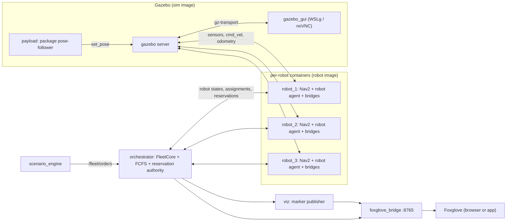

# SwarmFlow

*An interactive warehouse robotics digital twin and experimental fleet-optimization platform built with ROS 2, Docker
and Gazebo.* Differential-drive robots navigate a shared 3D warehouse in Gazebo Harmonic, collect packages at loading
stations and carry them to delivery stations, while a fleet layer decides who carries what and who may enter which
corridor when. It does not recreate any company's internal warehouse software or claim to have solved fleet congestion
universally; it is an extensible, measurable implementation of warehouse coordination techniques
([design](docs/design.md), section 19).

**v1 scope** (design sections 2.1 and 4.1):

- Standard warehouse layout only, generated from one layout definition (`layouts/standard/layout.yaml`).
- 3 custom differential-drive robots with Nav2, one shared robot image.
- One payload size (small, 0.40 x 0.40 m); packages ride on the robots visibly.
- Fleet layer: the SwarmFlow orchestrator (FCFS assignment to the nearest idle robot, FCFS exclusive zone
  reservations) plus one robot agent per robot. No Open-RMF in v1.
- A narrow-corridor traffic scene: Baseline A (independent Nav2) versus FCFS reservations (Baseline B).
- Gazebo GUI in a container plus Foxglove (map, robots, paths, zones, decision events).
- One-command `docker compose up` from Windows, decision logging, and a small-n metrics script.

## Quick start (Windows)

Prerequisites:

- Windows 11 with Docker Desktop (WSL2 backend).
- About 20 GB of free disk (the sim and robot images are about 5.2 GB each).
- An NVIDIA GPU is recommended for the Gazebo GUI. On the development laptop the Intel Arc adapter rendered a black
  scene through Mesa d3d12 and the NVIDIA adapter rendered correctly (design section 8.4, M1 spike). Without a GPU
  route the GUI falls back to software rendering, which costs about 5 CPU cores.
- Git, to clone this repository.

From PowerShell in the repository root:

```powershell
docker compose up
```

The first run builds the images. A cold, no-cache build from a fresh clone took about 10 minutes on the development
laptop (M7: `dev` 23 s, `sim` 285 s, `robot` 307 s, plus the one-time pull of the ROS base image); later runs start in
seconds. The fresh-clone path (`git clone` → `docker compose up` from PowerShell → stack healthy → deliveries) was
verified in M7 ([`docs/evidence/m7_fresh_clone_compose_up.png`](docs/evidence/m7_fresh_clone_compose_up.png)).

What appears:

- No Gazebo window by default: **Foxglove is the main view** (see [Foxglove](#foxglove)), with data on
  `ws://localhost:8765`. To also open the Gazebo window, add the `gui` profile (next section).
- Ports 8765 and 6080 are published on `127.0.0.1` only (the bridge and the noVNC view have no authentication).
- With the default scenario `v1_demo`, orders are released by the scenario engine and the robots deliver them.

Stop with Ctrl+C in the terminal, then `docker compose down` to remove the containers.

Note that `docker compose up` starts every service except `dev` (which has `replicas: 0` and is only used through
`docker compose run --rm dev ...`).

### Opening the Gazebo window

The Gazebo GUI is off unless you ask for it with the `gui` profile:

```powershell
docker compose --profile gui up
```

`SWARMFLOW_GUI` chooses how the window is shown:

| `SWARMFLOW_GUI` | Behaviour |
|---|---|
| `wslg` (default) | Gazebo GUI as a native window through WSLg (X11/Wayland sockets, GPU via `/dev/dxg` and Mesa d3d12). |
| `vnc` | GUI rendered in a virtual display and served in the browser at <http://localhost:6080/vnc.html> (software rendering, about 1.4 cores in the M1 spike). |
| `none` | No GUI; the `gazebo_gui` container exits immediately. Use this for headless runs. |

The Gazebo window shows the SwarmFlow overlay: a ring under each robot coloured by its status (green OK, amber
waiting or no recent update, red stuck or fault), the robot's path on the floor and its goal disc in the robot's
colour. The **SwarmFlow robots** panel on the right (a Gazebo GUI plugin, `src/swarmflow_gz_panel`) shows one card
per robot: status colour, robot colour, mode, speed, goal, order and its state, load, and the age of the last update.

`SWARMFLOW_GPU_ADAPTER` (default `NVIDIA`) is passed to Mesa as `MESA_D3D12_DEFAULT_ADAPTER_NAME` to pick the GPU
adapter for the WSLg route; set it to another adapter name if you have no NVIDIA GPU (value format unverified).

Setting variables in PowerShell, for one command:

```powershell
$env:SWARMFLOW_GUI="vnc"; docker compose --profile gui up
```

Or persistently, in a `.env` file next to `compose.yaml` (Docker Compose reads it automatically; `.env` is git-ignored):

```
SWARMFLOW_GUI=vnc
SWARMFLOW_RTF=0.5
```

Remember that `$env:` values persist in that PowerShell session; clear them with `Remove-Item Env:SWARMFLOW_GUI`.

If the WSLg window does not appear, `gui.sh` prints a hint to use `SWARMFLOW_GUI=vnc`. Docker Desktop may show a Windows
Firewall prompt when port 6080 is published; localhost access works whichever way you answer.

## What you are looking at

The standard warehouse (22.0 x 12.3 m, generated from `layouts/standard/layout.yaml`):

- Four racks (R1 to R4) run west to east. The three **1.30 m storage aisles** between them are exclusive zones
  `Z_aisle_1` to `Z_aisle_3`: robots may use them in both directions, but two robots cannot pass each other inside,
  so only one robot at a time may hold an aisle's lease.
- Each aisle end has an entry vertex and a **hold** vertex placed just outside the zone, so a waiting robot is off the
  exit path of the robot coming out.
- Stations: **L1 to L3** (loading, west wall), **D1 to D3** (delivery, east wall), **P1 to P4** (parking, corners).
- Wider main aisles (3.40 m) and cross aisles (2.20 m) connect the stations to the storage aisles.

The flow of one order:

1. An order (pickup station, dropoff station) is published on `/fleet/orders` by the scenario engine.
2. The orchestrator **assigns** it to the nearest idle robot (decision logged).
3. The robot agent drives to the pickup, loads the package (it appears on the robot), and navigates along its route.
4. At the **hold** vertex before a storage aisle the agent requests a zone reservation; it waits (mode
   `WAITING_RESERVATION`) until the orchestrator **grants** a lease.
5. The robot enters the **aisle**, exits (lease released), and **delivers** at the dropoff station, then parks.

Evidence from the build-up (screenshots in [`docs/evidence/`](docs/evidence/)):

- [`m4_g3_warehouse.png`](docs/evidence/m4_g3_warehouse.png): the generated warehouse in Gazebo.
- [`m4_g3_robot_with_package.png`](docs/evidence/m4_g3_robot_with_package.png): a robot carrying a package.
- [`m1_wslg_gpu_shapes.png`](docs/evidence/m1_wslg_gpu_shapes.png): the WSLg GPU spike (test world).
- [`m6_demo_oblique.png`](docs/evidence/m6_demo_oblique.png), [`m6_demo_topdown.png`](docs/evidence/m6_demo_topdown.png):
  the 10-minute demo (robots at stations, a package on a robot, a delivered package at its drop pose).
- [`m7_fresh_clone_compose_up.png`](docs/evidence/m7_fresh_clone_compose_up.png): the Gazebo window after a fresh clone
  and `docker compose up` from PowerShell.

## Foxglove

1. Start the stack (the `foxglove_bridge` and `viz` services are part of `docker compose up`).
2. In a current Foxglove app (desktop or <https://app.foxglove.dev>), open a connection: Foxglove WebSocket,
   `ws://localhost:8765`. The bridge speaks the current Foxglove protocol (`foxglove.sdk.v1`, verified in M6); the old
   Foxglove Studio 1.x protocol (`foxglove.websocket.v1`) is rejected.
3. Layouts menu, Import from file, choose [`viz/foxglove/swarmflow_v2.json`](viz/foxglove/swarmflow_v2.json)
   (imported and checked in app.foxglove.dev, T021).

What the layout shows:

- **Warehouse (3D)**: the world read from Gazebo's own `generated/world.sdf` (walls, racks, stations at their real
  sizes and colours), packages where Gazebo has them, and every robot in its Gazebo colour with its lidar, its
  footprint outline, the path it is following drawn on the floor and a pin on its current goal. Places carry symbols:
  pickup (green, arrow up), drop-off (blue, arrow down), home (`H`), waiting spots (yellow discs).
- **Robots**: one row per robot (mode, goal, order, loaded), green / amber / red; **Robot detail** shows every field
  of the selected robot (task, order state, next vertex, speed, leases, fault, age of the last update).
- **Orders** (`/fleet/order_status`), **Last decision** (`/fleet/decisions`).
- **New order**: edit the JSON (order id, pickup and drop-off station) and press *Publish order*; the bridge accepts
  client messages on `/fleet/orders` only.

How it works: `tf_relay` merges the robots' separate TF trees into one (`robot_1/base_link`, …) and republishes the
lidar scans with those frames; `viz_node` builds the scene, overlay and dashboard (`/viz/*` topics). The bridge
forwards only `/tf`, `/tf_static`, `/viz/*`, `/fleet/*` and the robots' plans, so raw scans, costmaps and maps stay
off the WebSocket. See also [`viz/foxglove/README.md`](viz/foxglove/README.md).

## Configuration

All variables are optional; defaults are set in [`docker/compose.yaml`](docker/compose.yaml). Pass them as shown in the
quick start.

| Variable | Default | Meaning |
|---|---|---|
| `SWARMFLOW_GUI` | `wslg` | Gazebo GUI route when started with `--profile gui`: `wslg`, `vnc` or `none`. |
| `SWARMFLOW_GPU_ADAPTER` | `NVIDIA` | Mesa d3d12 adapter name for the WSLg GUI. |
| `SWARMFLOW_LAYOUT` | `standard` | Layout name under `layouts/` used by the sim, robots, orchestrator, scenario engine, payload and viz. |
| `SWARMFLOW_ROBOTS` | `robot_1,robot_2,robot_3` | Robot ids the sim spawns and the orchestrator and payload nodes manage. The `robot_N` compose services are fixed to three; for a scenario with fewer robots start only those services (as `tests/integration/demo_run.sh` does). |
| `SWARMFLOW_RTF` | `1.0` | Real-time-factor cap for Gazebo (lower it if the CPU is hot; metrics are in sim time). |
| `SWARMFLOW_LOCALIZATION` | `ground_truth` | Robot localization: `ground_truth` (Gazebo pose) or `amcl` (see limitations). |
| `SWARMFLOW_AGENT` | `true` | Start the robot agent inside each robot container. |
| `SWARMFLOW_TRAFFIC_CONTROL` | `true` | Robot agent honours zone reservations. `false` makes robots drive straight into aisles. |
| `SWARMFLOW_POLICY` | `fcfs` | Orchestrator policy: `fcfs` (Baseline B) or `independent` (Baseline A). |
| `SWARMFLOW_SCENARIO` | `v1_demo` | Scenario file name in `scenarios/` (`v1_demo`, `v1_corridor`). |
| `SWARMFLOW_RUN_ID` | empty | Run directory name under `runs/`. Empty: both the orchestrator and the scenario engine use `<scenario>-<policy>-latest` (overwritten by the next run); set a unique id for measured runs, as `demo_run.sh` does. |
| `SWARMFLOW_GIT_SHA` | empty | Recorded in `runs/<run_id>/config.yaml`. |
| `SWARMFLOW_IMAGE_DIGESTS` | empty | Recorded in `runs/<run_id>/config.yaml`. |
| `SWARMFLOW_LAYOUTS_ROOT` | `/ws/layouts` (viz service) | Where the viz node finds layouts; set inside the container, rarely changed. |

**Baseline A** (independent Nav2 with stuck timeout, no reservations) is:

```powershell
$env:SWARMFLOW_SCENARIO="v1_corridor"; $env:SWARMFLOW_POLICY="independent"; $env:SWARMFLOW_TRAFFIC_CONTROL="false"; docker compose up
```

Variables used only by the scripts: `SWARMFLOW_LOCK_DIR` (lock directory, `scripts/lock.sh`).

## Experiments and metrics

Every run writes `runs/<run_id>/` (design section 13.5; `runs/` is bind-mounted and never committed):

| File | Written by | Content |
|---|---|---|
| `config.yaml` | scenario engine | Resolved scenario, git SHA, image digests. |
| `events.jsonl` | scenario engine | Scenario timeline events. |
| `decisions.jsonl` | orchestrator | Every assignment, grant, denial and other decision, with a reason. |
| `orders.jsonl` | orchestrator | Every order status change. |
| `robot_states.jsonl` | orchestrator | Robot states sampled at 2 Hz. |
| `metrics.csv` | `tools/metrics/compute.py` | Deliveries, throughput, latency, waiting time, stuck events, failed orders, clearance violations. |

Scripts (lead-only, they take the sim lock and run Gazebo):

- `tests/integration/gate_run.sh <run_id> [timeout_s]`: full stack, one order per robot through a storage aisle, PASS
  when all three are delivered. This is the M5 gate run.
- `tests/integration/demo_run.sh <run_id> [minutes] [scenario] [policy] [screenshot]`: unattended scenario run
  (GUI screenshots near the end) followed by metrics and per-container CPU (`runs/<run_id>/cpu_end.txt`). Example:
  `tests/integration/demo_run.sh v1_corridor-independent-s1-r1 7 v1_corridor independent`.

Metrics, run on the host (needs Python with PyYAML; or use the `dev` container):

```bash
python tools/metrics/compute.py runs/<run_id>            # writes runs/<run_id>/metrics.csv
python tools/metrics/compare.py runs/<a> runs/<b> ... [--out table.md]   # mean +/- 95 % CI per scenario and policy
```

### Corridor scene results (n = 3)

`scenarios/v1_corridor.yaml`: 2 robots, a backlog of 8 orders (L2 → D2 / L2 → D1), so a robot returning from D2 meets
the other one, loaded, head-on in storage aisle `Z_aisle_2`. 300 s per run, Gazebo, n = 3 per policy, mean ± 95 % CI
(t-distribution; `tools/metrics/compare.py`). Measured 2026-10-09 (M7, MPPI at 20 Hz):

| policy | n | deliveries | throughput /min | mean latency s | mean wait s | stuck events | failed orders | clearance violations |
|---|---|---|---|---|---|---|---|---|
| FCFS reservations (Baseline B) | 3 | 6.00 ± 4.30 | 1.20 ± 0.86 | 204.95 ± 103.71 | 56.00 ± 66.54 | 0.67 ± 2.87 | 0.67 ± 2.87 | 0.00 ± 0.00 |
| independent Nav2 (Baseline A) | 3 | 3.00 ± 0.00 | 0.60 ± 0.00 | 169.07 ± 114.22 | 117.91 ± 55.42 | 1.00 ± 2.48 | 1.00 ± 2.48 | 1.33 ± 3.79 |

With reservations one robot holds at `H_2_1` / `H_2_3` while the other passes (≈ 50 denies per run); without them both
robots drive into the 1.3 m aisle, block each other and wait (twice the waiting time, half the deliveries, stuck
timeouts and footprint overlaps). n = 3 makes the intervals wide; the claim is the direction, not the size. The FCFS
stuck events came from the Nav2 controller missing its rate under CPU load (fixed in M8, below).

**After M8 hardening** (MPPI 15 Hz x 800 x 30, static-only global costmap, custom NavigateThroughPoses BT that drops
passed waypoints every tick). Measured 2026-10-10, same scenario and method, `docs/results/m8_corridor_n3.md`:

| policy | n | deliveries | throughput /min | mean latency s | mean wait s | stuck events | failed orders | clearance violations |
|---|---|---|---|---|---|---|---|---|
| FCFS reservations (Baseline B) | 3 | 7.00 ± 0.00 | 1.40 ± 0.00 | 221.10 ± 1.78 | 36.08 ± 4.58 | 0.00 ± 0.00 | 0.00 ± 0.00 | 0.00 ± 0.00 |
| independent Nav2 (Baseline A) | 3 | 3.33 ± 3.79 | 0.67 ± 0.76 | 180.22 ± 29.93 | 101.67 ± 95.48 | 2.67 ± 1.43 | 2.67 ± 1.43 | 2.00 ± 0.00 |

FCFS now runs identically three times (22–25 denies per run, no controller-rate warnings); Baseline A still jams in
the aisle (2–3 stuck timeouts and 2 footprint overlaps per run).

### 10-minute demo

`scenarios/v1_demo.yaml` (3 robots, 3 orders/min, FCFS), unattended: **15 deliveries, 0 stuck, 0 failed** (M8,
`runs/m8b-demo-1`; M6 before tuning: 14 and 10). Its 3 padded-footprint overlaps (max 11 cm, i.e. about 1 cm between
the real 0.60 x 0.50 m bodies) are one repeated pattern: a robot leaving `Z_aisle_1` eastwards meets a robot coming
from the D stations at the unreserved east-trunk junction (18.6, 3.85). See "Known limitations".

## Architecture



- **Gazebo server / GUI** (`gazebo`, `gazebo_gui`): headless physics server and an optional GUI client on the same
  `GZ_PARTITION`.
- **Robot containers** (`robot_1` to `robot_3`): Nav2, the SwarmFlow robot agent (the only bridge from fleet decisions
  to Nav2: it runs a route, holds at zone entries and requests leases) and the ROS-Gazebo bridges.
- **Orchestrator** (`orchestrator`): a pure-Python library (`swarmflow_core`) with FCFS assignment and the zone
  reservation authority, wrapped by a thin ROS adapter (`swarmflow_orchestrator`); it writes the decision and order logs.
- **Scenario engine** (`scenario_engine`): reads `scenarios/*.yaml`, releases orders and writes the run record.
- **Payload** (`payload`): moves package models with the carrying robot (kinematic pose-follower).
- **Viz** and **Foxglove bridge**: marker topics and a WebSocket on port 8765 for Foxglove.

Full architecture: [design section 6](docs/design.md).

## Development

Everything builds and tests inside the `dev` image. Set a per-worktree compose project first (AGENTS.md section 6):

```bash
export COMPOSE_PROJECT_NAME=swarmflow-$(basename "$(git rev-parse --show-toplevel)" | tr A-Z a-z) SWARMFLOW_GUI=none
docker compose run --rm dev colcon build --symlink-install --parallel-workers 2
docker compose run --rm dev colcon test --packages-select <pkg>
docker compose run --rm dev pytest src/swarmflow_core -q
scripts/ci.sh        # the referee: contract diff, owned files, hygiene, build, tests
```

- Rules for contributors and agents: [`AGENTS.md`](AGENTS.md). Design: [`docs/design.md`](docs/design.md). Work plan:
  [`docs/milestones.md`](docs/milestones.md). Task cards: [`docs/tasks/`](docs/tasks/). Agent logs:
  [`docs/agent_log/`](docs/agent_log/). Decisions: [`docs/decisions/`](docs/decisions/).
- Contracts (ROS interfaces, layout schema, orchestrator API, fixtures) are frozen and change only on `lead/contract-*`
  branches.
- Only one Gazebo simulation may run at a time (the laptop has a thermal limit). Use `scripts/sim_lock.sh`
  (`acquire` / `release`) and keep sessions short; builds are serialised with `scripts/lock.sh build`.
  Gazebo-starting services carry the label `swarmflow.sim=1`; `docker ps --filter label=swarmflow.sim=1 -q` must be
  empty before you start one.
- Non-ROS code (`sim2d/`, `tools/`) is tested with pytest; `swarmflow_core` must not import ROS.

## Known limitations (v1)

- **Ground-truth localization** by default (`SWARMFLOW_LOCALIZATION=ground_truth`): wheel odometry drifted by metres in
  testing, and three AMCL instances are costly on the target laptop. AMCL mode exists but is untested
  ([decision 001](docs/decisions/001-ground-truth-localization.md)).
- **Front 180 degree LiDAR**, front-centre at 0.20 m height (design section 7.1 as built): robots cannot sense behind
  them, so the reverse speed is limited to 0.15 m/s.
- **Packages are kinematic**: a pose-follower moves them with the robot; there is no contact physics.
- **One payload size** (small).
- **No workers or corridor closures** (v2).
- **FCFS has no starvation guard** (v2).
- **Station claims serialise same-station orders**: an order waits while another order still has its pickup station
  (until picked up) or dropoff station (until delivered). This prevents station gridlock but lowers throughput.
- **Hold vertices sit 1.0 m beside the main-aisle trunks**: a robot waiting at a hold narrows the trunk, so passing
  robots come within the 0.05 m footprint padding (counted as clearance violations ≤ 0.10 m) and occasionally hit the
  60 s stuck timeout. Moving the holds needs a change of the frozen layout fixtures (listed for the user, v1 G5).
- **Trunk junctions are not reserved**: only storage aisles are exclusive zones. Where an aisle meets a trunk, a robot
  leaving the aisle and a robot travelling on the trunk rely on Nav2's local avoidance and can come within the
  footprint padding (the 3 overlaps of the M8 demo, all at the east end of `Z_aisle_1`). Junction zones or moved
  trunks change the layout contract (listed for the user).
- The `viz` container uses about 0.9 CPU core with 3 robots (Python TF relay, scene and Gazebo overlay; T021/T022
  measurement, not yet profiled).
- **Open-RMF** appears only in v2 (Baseline C); v1 has no RMF or free_fleet dependency.

## Repository layout

| Path | Content |
|---|---|
| `compose.yaml`, `docker/` | Root compose file, service definitions, Dockerfiles, `gui.sh`. |
| `src/swarmflow_interfaces/` | ROS messages, services and actions (frozen contract). |
| `src/swarmflow_core/` | Orchestrator library (pure Python, no ROS). |
| `src/swarmflow_orchestrator/` | ROS adapter and launch for the orchestrator. |
| `src/swarmflow_robot_agent/` | Per-robot agent. |
| `src/swarmflow_description/`, `src/swarmflow_gazebo/`, `src/swarmflow_nav/` | Robot model, Gazebo world bringup, Nav2 bringup. |
| `src/swarmflow_scenarios/`, `src/swarmflow_payload/`, `src/swarmflow_viz/` | Scenario engine, package pose-follower, marker publisher. |
| `layouts/` | Layout definitions and generated world, map and graph (`layouts/schema/` is frozen). |
| `scenarios/` | Scenario files (`v1_demo`, `v1_corridor`). |
| `sim2d/` | 2D kinematic simulator and benchmark support. |
| `tools/` | Layout generator, scenario tools, metrics. |
| `viz/` | Foxglove layout. |
| `scripts/` | CI referee and lock scripts. |
| `tests/` | Fixtures, unit and integration tests. |
| `docs/` | Design, milestones, task cards, decisions, agent logs, evidence. |

## License

Apache-2.0 (see the `package.xml` files).
